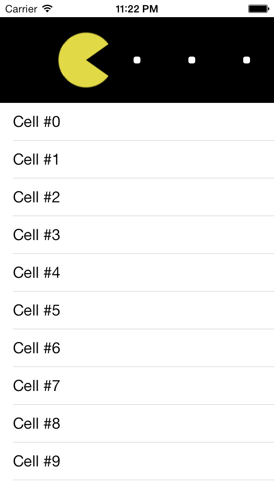

JZRefreshControl
===========
Overview
-----------
The same old refresh controls are boring. Using the standard \*yawn\* spinner is the same thing as wearing your grandfather's finest dress slacks pulled up to your rib cage and sinched off with a basket-weave belt. You wouldn't do that so let's get creative and add some jaw-dropping badassery to your apps!

JZRefreshControl is an easily extendable class that makes it dead simple to create a custom refresh control that will have your users so engaged they'll be opening your app and pulling to refresh night and day.*

\* Jeremy Zedell is not responsible for increased API requests due to users' inability to stop refreshing.

Getting Started
---------------
Simple to use. Just subclass **JZRefreshControl** and override 3 methods.

	- (void)amountOfControlVisible:(CGFloat)visibiliy
When the user pulls on the UITableView, this method will be called repeatedly while the refresh control is visible on screen. @param visibility is the vertical percentage of the refresh control that is currently visible (ranges from 0 - 1). The visibility value can be used to animate the positioning of elements in the refresh control to prepare them for the refresh animation.
	
	- (void)refreshingWithDelta:(CGFloat)delta
When the user releases the UITableView, this method will be called at every display frame while the refresh is in progress. @param delta is the amount of time in seconds that has passed since the last time this method was called. If the display is running at 60 fps, delta will be ~1/60 of a second every time the method is called.

	- (void)reset
When refreshing has completed and the refresh control has been hidden, this method will be called. In your implementation of reset, you should reposition your views as they should be at the beginning of a refresh.

Then, in your UITableViewDelegate, implement these 2 UIScrollViewDelegate methods and pass the messages along to your refresh control

	- (void)scrollViewDidScroll:(UIScrollView *)scrollView
	{
		[self.refreshControl scrollViewDidScroll:scrollView];
	}
	
	- (void)scrollViewWillEndDragging:(UIScrollView *)scrollView withVelocity:(CGPoint)velocity targetContentOffset:(inout CGPoint *)targetContentOffset
	{
		[self.refreshControl scrollViewWillEndDragging:scrollView withVelocity:velocity targetContentOffset:targetContentOffset];
	}

Next, in your UIViewController (or UITableViewController) in viewDidLoad, setup your refresh control.

	- (void)viewDidLoad
	{
	    [super viewDidLoad];
		self.refreshControl = [[MyRefreshControl alloc] initWithFrame:CGRectMake(0, 0, self.tableView.frame.size.width, [MyRefreshControl height])];
		self.refreshControl.tableView = self.tableView;
		// remember to avoid retain cycles!
		__weak ViewController *weakSelf = self;
		self.refreshControl.refreshBlock = ^{
			[weakSelf performRefreshOrWhatever];
		};
	}

Finally, when you're done refreshing your data and reloading your UITableView, call endRefreshing.

	- (void)performRefreshOrWhatever
	{
		[self refreshDataThenCallBlock:^{
			[self.refreshControl endRefreshing];
		}];
	}

You can also force the refresh to happen without the user pulling.

	[self.refreshControl beginRefreshing];

Take a look at the example for more info and a little Pacman action.

Creator
------

[Jeremy Zedell](http://github.com/JLZ)

License
-------
JZSwipeCell is available under the MIT license. See the LICENSE file for more info.